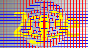

# Captcha_NumAlphabet
基于CNN的数字字母验证码识别训练项目pytorch版

## 实例
数据集、数据集模型已上传至网盘，环境测试时可下载 （百度云：链接：https://pan.baidu.com/s/1DglFQ1hl3mHzAooWxqBU8g 提取码：aegd ） 
 
实际训练过程中出现标签数据重复时，可通过'标签_随机值.jpg'实现相同标签的图片多样化，例：2Ab6_1231345.jpg

## 数据集展示

